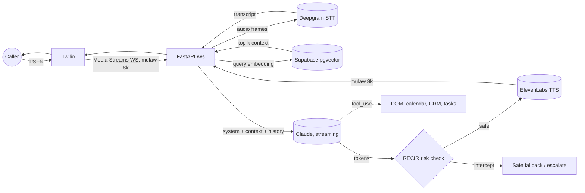

# Voice AI Agent

Autonomous voice agent that answers inbound phone calls, understands intent in
real time, answers from approved company data, enforces a compliance/risk layer
on every spoken response, and drives downstream legal and operational workflows.

Built for low latency (target: under 600ms end-to-end per turn), strict
governance, and full auditability.

## Pipeline



### Layers (mapped to the request)

| Layer | Module | Responsibility |
|-------|--------|----------------|
| A. Ingestion & Streaming | `app/main.py`, `app/telephony/`, `app/stt/` | Secure WebSocket, Twilio Media Streams framing, Deepgram STT with endpointing and noise filtering, graceful handling of jitter and unexpected termination. |
| B. Contextual Intelligence & RAG | `app/rag/`, `app/llm/` | pgvector similarity search over approved public knowledge, Sandbox Guardrail baked into the system prompt, Claude token streaming for low TTFB. |
| C. Algorithmic Risk Management (RECIR) | `app/governance/risk.py`, `app/state/session.py` | Per-utterance risk detection, compliance filter with safe fallback, session state and compliance scoring logged to PostgreSQL. |
| D. Action Execution (DOM) | `app/actions/` | Structured entity extraction via Claude function calling, driving scheduling, CRM lead capture, and internal task creation. |
| Escalation Matrix | `app/governance/escalation.py`, `app/telephony/twilio_stream.py` | Transfer to a human on frustration, loop behaviour, high-risk compliance triggers, explicit request, or runaway length. |

## How latency stays under budget

1. **Sentence-level streaming.** Claude tokens are flushed to TTS at each
   sentence boundary (`app/llm/claude_orchestrator.py`), so the first words play
   long before the full reply is generated.
2. **Prompt caching.** The large guardrail preamble and tool schemas are marked
   `cache_control`, so only the small per-turn context is uncached. This cuts
   Time-to-First-Byte on every turn after the first.
3. **Native wire format.** ElevenLabs synthesizes `ulaw_8000`, identical to
   Twilio's wire format, so no resampling sits between TTS and the phone.
4. **Hot path stays non-blocking.** Persistence is fire-and-forget, actions run
   in the background, and TTS is cancellable for instant barge-in.

## Governance and safety

* **Sandbox Guardrail:** the agent answers only from the per-turn RAG context.
  When context is missing it says so and offers a human, never inventing facts.
* **RECIR pre-flight:** every candidate sentence is scored before it is spoken.
  A deterministic rule pass (sub-millisecond) catches unauthorized advice,
  binding or financial commitments, and confidential exposure. An optional LLM
  judge resolves grey areas. Interceptions are written to `compliance_violations`.
* **Escalation:** frustration accumulation, agent or intent loops, critical
  compliance triggers, and explicit human requests all route the live call to a
  human operator via a Twilio REST redirect.

## Data model

`supabase/migrations/0003_voice_agent.sql` (in the repo's shared migrations)
defines `calls`, `transcripts`, `intent_logs`, `compliance_violations`, and the
`knowledge_chunks` RAG corpus with a `match_knowledge` cosine-search function.
Row Level Security keeps every table service-role write only, admin read only.

## Run it

```bash
cd voice-agent
python -m venv .venv && . .venv/bin/activate
pip install -r requirements.txt
cp .env.example .env   # fill in your keys

# apply the migration to Supabase/Postgres (one of):
#   supabase db push
#   psql "$DATABASE_URL" -f ../supabase/migrations/0003_voice_agent.sql

uvicorn app.main:app --host 0.0.0.0 --port 8080
```

Point your Twilio number's Voice webhook at `POST /twiml`. Twilio then opens the
media stream to `/ws` and the call is live.

```bash
pytest        # governance logic tests (no network required)
```

## Layout

```
voice-agent/
  app/
    main.py                  FastAPI app + per-call pipeline (barge-in, turns, escalation)
    config.py                typed settings from env
    models.py                pydantic domain models mirroring the SQL schema
    telephony/twilio_stream  Media Streams framing + human transfer
    stt/deepgram_client      streaming STT over WebSocket
    tts/elevenlabs_client    streaming TTS (ulaw_8000)
    llm/                      prompts (guardrails) + Claude orchestrator + judge
    rag/retriever            embeddings + pgvector retrieval
    governance/              RECIR risk engine + escalation matrix
    actions/                 tool schemas + action executor (DOM)
    state/                   asyncpg pool + session tracking/logging
  tests/                     risk + escalation unit tests
```

Note: LLM provider, model ids, pricing, and parameters change often. Confirm the
current Claude model ids and the ElevenLabs/Deepgram model names against their
docs before deploying to production.
